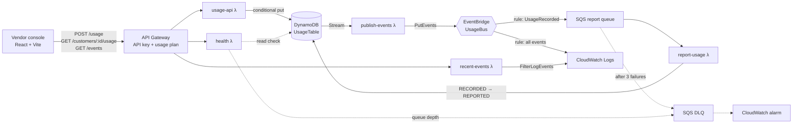

# marketplace-metering

A personal project for learning AWS: a small usage-metering backend, serverless and event-driven, defined entirely in AWS CDK (TypeScript).

A vendor sends **usage records**, for example "customer X made 1,200 API calls between 10:00 and 11:00". The system stores each record **exactly once**, even when it is sent twice. It **publishes a change event** on EventBridge and **reports the usage downstream** through a queue with retries and a dead-letter queue. A small React console lets you send usage and watch it move through the system live.

## Architecture



**One record, step by step:**

1. The console sends `POST /usage`. API Gateway checks the API key and the throttling limits.
2. **usage-api** validates the record and floors the timestamp to the hour. It writes the record with `attribute_not_exists(PK)`, so DynamoDB itself refuses a duplicate. Sending the same record again returns 200 (an idempotent replay). Sending the same key with a different quantity returns **409**.
3. The insert shows up on the **DynamoDB Stream**. **publish-events** turns it into a clean `UsageRecorded` event and puts it on the **UsageBus** event bus. Publishing from the stream acts as a transactional outbox: no event is lost when the write succeeds and the publish fails.
4. Two **EventBridge rules** fan the event out:
   - `RouteUsageRecorded` matches `detail-type: UsageRecorded` and sends it to an **SQS** queue.
   - `LogAllUsageEvents` matches everything and sends it to CloudWatch Logs.
5. **report-usage** drains the queue and marks the record `REPORTED`, but only if it is still `RECORDED`. A redelivered message then fails that condition and counts as success. The downstream call is stubbed with a configurable failure rate (default 20%) to stand in for a throttling marketplace. A failed message comes back after the visibility timeout, and after 3 attempts it goes to the **DLQ**, which raises a **CloudWatch alarm**.
6. The status change goes back through the stream, so publish-events emits `UsageReported`. In the console the record's status flips, and both events appear in the EventBridge panel.

## The vendor console

Top to bottom:

- **Server health.** It is checked on load and again whenever you click **Check health**. `GET /health` proves that API Gateway, the API key and Lambda work, then checks a DynamoDB read and the dead-letter queue depth. The result is Healthy, Degraded or Down.
- **Usage.** A bar chart of one department's hourly usage, with tabs for API calls and GB stored. Bar colour shows whether each hour has been reported to billing yet. There is a table view as well.
- **Events.** A plain-language view of EventBridge. A change is announced on the bus, and two listeners (the billing reporter and the audit log) each receive the events they subscribed to. Click a listener to see only what it received. The live feed shows "New usage" followed by "Reported" for the same record, with how long it took. Expand a row to see the raw event.
- **Request log & alarms.** A CloudWatch-style log of every request the console sent, with INFO, WARN and ERROR levels and filtering. It sits under four alarm tiles: server errors, rejected requests, health check and failed reports (DLQ).
- **Send usage** (top right) opens a dialog with **Generate**, **Generate random batch**, and buttons to demo an idempotent replay and a 409 conflict.

Live refresh polls every 4 seconds and pauses while the tab is hidden. A record that hits the simulated failure stays orange for about 30 seconds while SQS retries it.

## Reliability choices worth discussing

| Concern | How it's handled |
|---|---|
| Duplicate API calls | DynamoDB conditional write; replay → 200, conflict → 409 |
| Write succeeds, publish fails | Events come from the DynamoDB Stream (outbox pattern) |
| One bad stream record blocking the shard | `bisectBatchOnError`, `retryAttempts: 3`, `reportBatchItemFailures` |
| `PutEvents` partially failing | Per-entry `ErrorCode` check; only failed records are retried |
| At-least-once delivery to the consumer | Conditional `RECORDED → REPORTED` update makes the consumer idempotent |
| Downstream outage | SQS retries, a DLQ after 3 attempts, and an alarm on DLQ depth |
| Public endpoint abuse | API key, usage plan (5 req/s, 10k/day), key kept server-side by the Vite proxy |

## Running it

Prerequisites: Node 22+, the AWS CLI logged in to your account, and CDK bootstrapped in `ca-central-1` (`npx cdk bootstrap`).

```powershell
npm install
npm test                                   # unit + stack assertion tests
npx cdk deploy --outputs-file cdk-outputs.json
```

Optional: change the simulated downstream failure rate with `npx cdk deploy -c reportFailureRate=0` (or `0.5` to watch the DLQ fill).

Then the console:

```powershell
# copy the API URL from cdk-outputs.json into console/.env.local as API_URL, then fetch the key:
aws apigateway get-api-key --api-key <UsageApiKeyId> --include-value --query value --output text
# put that in console/.env.local as API_KEY
npm run dev:console                        # http://localhost:5173
```

Tear down when you're done: `npx cdk destroy`. Everything sits in the free tier or costs cents.

## Layout

```
bin/   CDK app entry
lib/   the stack (API Gateway, Lambda, DynamoDB, EventBridge, SQS, CloudWatch)
src/   Lambda handlers: handler (usage-api), publish-events, report-usage, recent-events, health
test/  Jest tests with aws-sdk-client-mock, plus CDK template assertions
console/  React + Vite vendor console
```
